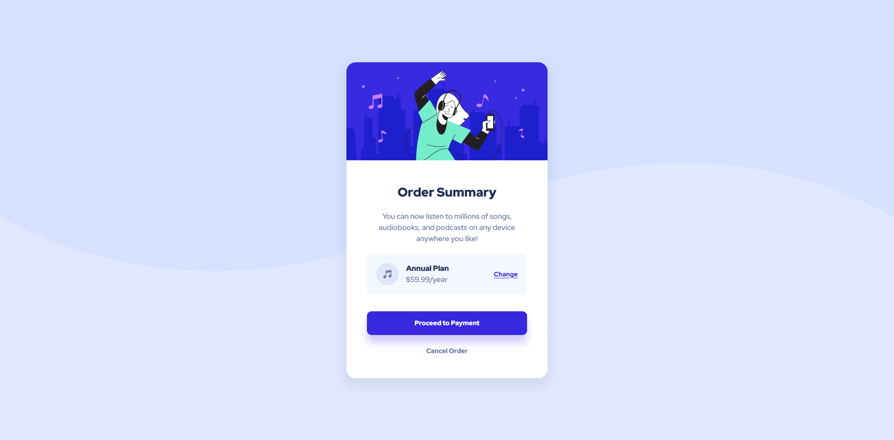

# Frontend Mentor - Order summary card solution

This is a solution to the [Order summary card challenge on Frontend Mentor](https://www.frontendmentor.io/challenges/order-summary-component-QlPmajDUj). Frontend Mentor challenges help you improve your coding skills by building realistic projects. 

## Table of contents

- [Overview](#overview)
  - [The challenge](#the-challenge)
  - [Screenshot](#screenshot)
  - [Links](#links)
- [My process](#my-process)
  - [Built with](#built-with)
  - [What I learned](#what-i-learned)
  - [Continued development](#continued-development)
  - [Useful resources](#useful-resources)
- [Author](#author)

## Overview

### The challenge

Users should be able to:

- See hover states for interactive elements

### Screenshot

### Links

- Solution URL: [GitHub](https://github.com/mbdelarosa/order-summary-component-main)
- Live Site URL: [Order Summary Component](https://mbdelarosa.github.io/order-summary-component-main/)

## My process

### Built with

- Semantic HTML5 markup
- CSS custom properties
- Flexbox
- Mobile-first workflow

### What I learned

Through this challenge, I was able to learn the following:
- When to use anchors vs buttons
- Media queries
- How to add background images

This challenge was also very helpful in understanding how Flexbox works. I was also able to use it in this challenge to add spacing between flex items using the `gap` property instead of adding margins to individual components.

### Continued development

For future challenges, I'd like to be able to learn and utilize the following:
- Use of `clamp()`
- Follow better CSS naming conventions (ex. BEM)

### Useful resources

A lot of community members recommended watching videos by Kevin Powell, and for this challenge the following proved to be very useful:
- ["Learn flexbox the easy way"](https://youtu.be/u044iM9xsWU) - This was a really good introduction to Flexbox, its behavior and properties and the different scenarios on how to use it
- ["You can do that with margins?""](https://youtu.be/Azfj1efPAH0) - While not Flexbox-related, this helped me understand the behavior of the `margin` property. I was able to apply the `margin-left: auto` property in this challenge

## Author

- Frontend Mentor - [@mbdelarosa](https://www.frontendmentor.io/profile/mbdelarosa)